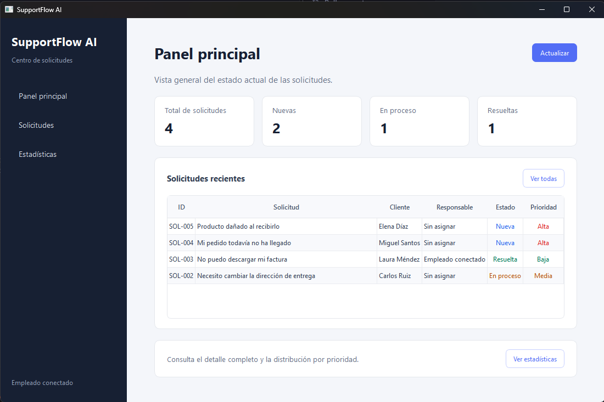
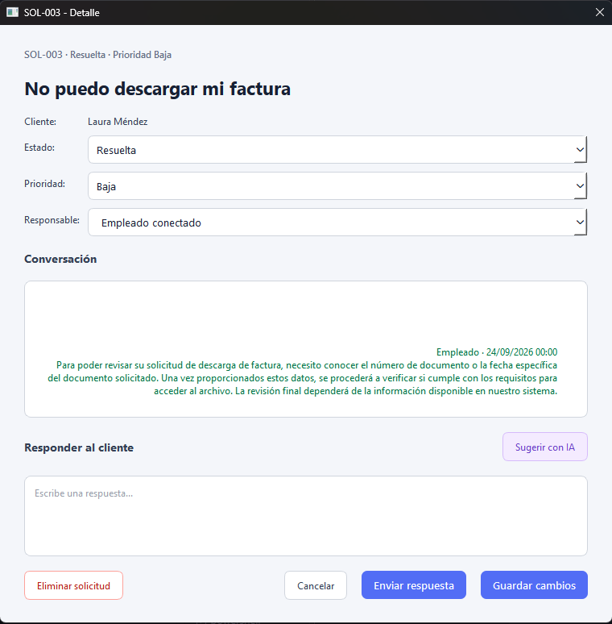
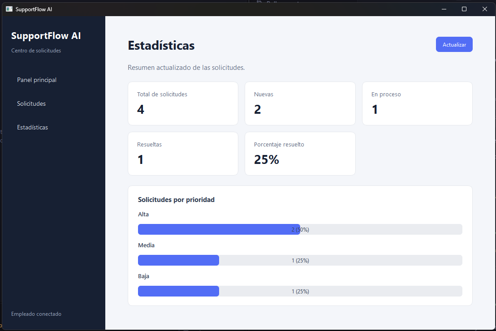

# SupportFlow AI

[](https://github.com/wasatnight/supportflow-ai/actions/workflows/tests.yml)

Aplicación de escritorio para gestionar solicitudes de soporte, mantener conversaciones con clientes y generar sugerencias de respuesta mediante inteligencia artificial local.

El proyecto utiliza una arquitectura cliente-servidor con PySide6, FastAPI, PostgreSQL y Ollama.

## Características

- Creación, consulta, actualización y eliminación de solicitudes.
- Estados: Nueva, En proceso y Resuelta.
- Prioridades: Alta, Media y Baja.
- Asignación y filtrado por responsable.
- Historial persistente de conversaciones.
- Sugerencias de respuesta mediante IA local.
- Revisión humana antes de enviar respuestas generadas.
- Panel principal con solicitudes recientes.
- Estadísticas por estado y prioridad.
- Base de datos PostgreSQL administrada con Alembic.
- API documentada automáticamente con Swagger.
- Pruebas automatizadas con cobertura mínima del 80%.

## Tecnologías

### Servidor backend

- Python
- FastAPI
- SQLAlchemy
- PostgreSQL
- Alembic
- Pydantic
- Uvicorn

### Escritorio

- Python
- PySide6
- HTTPX

### Inteligencia artificial

- Ollama
- Qwen 3.5 4B

### Pruebas

- pytest
- pytest-cov
- SQLite en memoria

## Capturas de pantalla

### Panel principal



### Gestión y conversación de solicitudes



### Estadísticas



## Arquitectura

```text
supportflow-ai/
├── backend/
│   ├── app/
│   │   ├── core/
│   │   ├── db/
│   │   ├── models/
│   │   ├── repositories/
│   │   ├── schemas/
│   │   ├── services/
│   │   └── main.py
│   ├── migrations/
│   ├── tests/
│   ├── .env.example
│   └── alembic.ini
├── desktop/
│   └── app/
│       ├── models/
│       ├── repositories/
│       ├── views/
│       ├── workers/
│       └── main.py
├── requirements.txt
├── requirements-dev.txt
├── pyproject.toml
└── README.md
```

## Requisitos

- Python 3.14 o superior
- PostgreSQL
- Ollama
- Windows 10 u 11

## Instalación

### 1. Crear el entorno virtual

```powershell
py -3.14 -m venv .venv
Set-ExecutionPolicy -Scope Process -ExecutionPolicy RemoteSigned
& .\.venv\Scripts\Activate.ps1
```

### 2. Instalar las dependencias

Para ejecutar la aplicación:

```powershell
python -m pip install -r requirements.txt
```

Para desarrollo y pruebas:

```powershell
python -m pip install -r requirements-dev.txt
```

### 3. Configurar PostgreSQL

Crea el usuario y la base de datos:

```sql
CREATE USER supportflow_app WITH PASSWORD 'tu_contraseña';
CREATE DATABASE supportflow_db OWNER supportflow_app;
```

Copia el archivo de configuración:

```powershell
Copy-Item .\backend\.env.example .\backend\.env
```

Edita `backend/.env` con tus datos:

```env
DB_USER=supportflow_app
DB_PASSWORD=tu_contraseña
DB_HOST=localhost
DB_PORT=5432
DB_NAME=supportflow_db
```

### 4. Aplicar las migraciones

```powershell
cd .\backend
python -m alembic upgrade head
```

Opcionalmente, agrega las solicitudes iniciales:

```powershell
python -m app.db.seed
```

## Configuración de Ollama

Descarga el modelo una sola vez:

```powershell
ollama pull qwen3.5:4b
```

Antes de utilizar las sugerencias de IA, abre Ollama desde Windows.

La IA solamente genera un borrador. El empleado debe revisar y enviar manualmente la respuesta.

## Ejecución

### Backend

Desde la carpeta `backend`:

```powershell
python -m uvicorn app.main:app --reload
```

La API estará disponible en:

```text
http://127.0.0.1:8000
```

Documentación Swagger:

```text
http://127.0.0.1:8000/docs
```

### Aplicación de escritorio

En otra terminal:

```powershell
cd .\desktop
python -m app.main
```

## Ejecución de pruebas

Desde la raíz del proyecto:

```powershell
python -m pytest -q
```

Estado actual:

```text
12 pruebas aprobadas
83.62% de cobertura
Cobertura mínima requerida: 80%
```

Las pruebas utilizan SQLite en memoria y no modifican la base de datos PostgreSQL.

## Endpoints principales

| Método | Endpoint                               | Descripción               |
| ------ | -------------------------------------- | ------------------------- |
| GET    | `/health`                              | Estado de la API          |
| GET    | `/requests`                            | Listar solicitudes        |
| POST   | `/requests`                            | Crear una solicitud       |
| PATCH  | `/requests/{request_id}`               | Actualizar una solicitud  |
| DELETE | `/requests/{request_id}`               | Eliminar una solicitud    |
| GET    | `/requests/{request_id}/messages`      | Consultar conversación    |
| POST   | `/requests/{request_id}/messages`      | Agregar un mensaje        |
| POST   | `/requests/{request_id}/ai-suggestion` | Generar sugerencia con IA |
| GET    | `/statistics/summary`                  | Consultar estadísticas    |

## Estado del proyecto

Proyecto desarrollado como parte de un portafolio profesional. Actualmente está preparado para ejecutarse en un entorno local.
